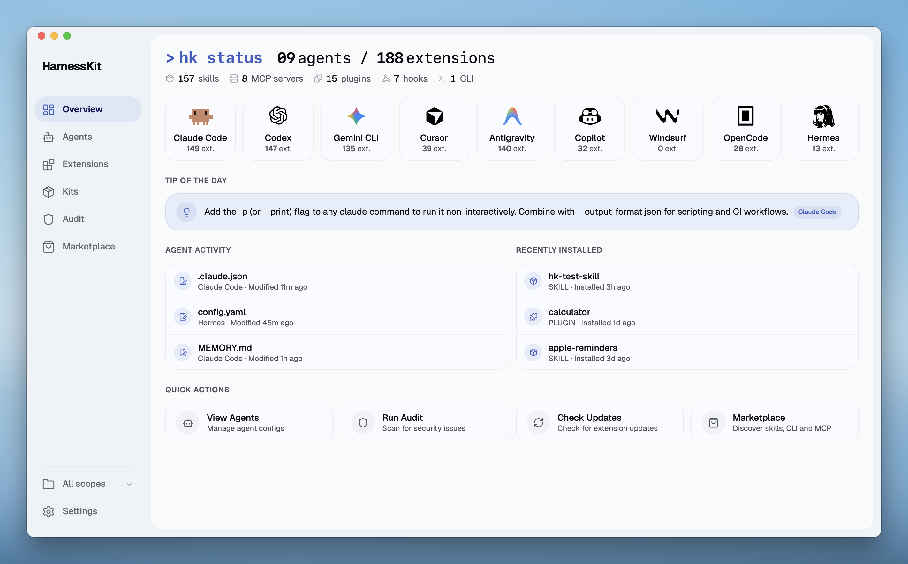

<p align="center">
  
</p>

<h1 align="center">HarnessKit</h1>

<p align="center">
  <a href="README.md">English</a> · <strong>简体中文</strong>
</p>

<p align="center">
  <strong>所有 Agent，一处管理。</strong><br/>
  免费、开源的一站式平台，统一管理你所有的 AI 编程 Agent —— 覆盖桌面、CLI、Web 三端。
</p>

<p align="center">
  <a href="https://github.com/RealZST/HarnessKit/releases/latest"></a>
  <a href="https://github.com/RealZST/HarnessKit/releases"></a>
  <a href="LICENSE"></a>
  <a href="#快速开始"></a>
</p>

<p align="center">
  <a href="#为什么选择-harnesskit">为什么</a>&nbsp;&nbsp;&bull;&nbsp;&nbsp;<a href="#核心特性">核心特性</a>&nbsp;&nbsp;&bull;&nbsp;&nbsp;<a href="#快速开始">快速开始</a>&nbsp;&nbsp;&bull;&nbsp;&nbsp;<a href="#未来计划">未来计划</a>
</p>

<br/>

<p align="center">
  
</p>

<br/>

## 为什么选择 HarnessKit？

每个 Agent 都自成体系。扩展、配置、记忆、规则分散在各自的目录中，格式与约定各异。

**HarnessKit 将它们集中到一处** —— 在同一界面内，看清、把控、统管你所有的 Agent。

<p align="center">
  
</p>

---

## 核心特性

### 🧩 全套扩展管理

HarnessKit 通过统一界面管理 **全部五种扩展类型** —— **Skill**、**MCP server**、**Plugin**、**Hook** 与 **Agent-first CLI**。

<div align="center">

| Agent | Skill | MCP | Plugin | Hook | Agent-first CLI |
|:---|:---:|:---:|:---:|:---:|:---:|
| **Claude Code** | ✓ | ✓ | ✓ | ✓ | ✓ |
| **Codex** | ✓ | ✓ | ✓ | ✓ | ✓ |
| **Gemini CLI** | ✓ | ✓ | ✓ | ✓ | ✓ |
| **Cursor** | ✓ | ✓ | ✓ | ✓ | ✓ |
| **Antigravity** | ✓ | ✓ | — | — | ✓ |
| **Copilot** | ✓ | ✓ | ✓ | ✓ | ✓ |
| **Windsurf** | ✓ | ✓ | — | ✓ | ✓ |
| **OpenCode** | ✓ | ✓ | ✓ | — | ✓ |

<small><i>* "—" 表示该 Agent 目前不支持此扩展类型。</i></small>

</div>

- **分门别类** —— 按 *类型*、*Agent* 或 *来源* 筛选，按名称搜索。来自同一仓库的扩展会自动归为 *套装*，可批量管理。
- **一览无余** —— 每个扩展的 *所属 Agent*、*权限*、*信任评分* 与 *状态* 直接列在表格中。展开详情面板，每个 Agent 下的 *文件路径*、*目录结构* 与 *审计结果* 也都一目了然。
- **一键启停** —— 在列表中直接启用或禁用扩展，更新检查也只需一键。
- **跨 Agent 部署** —— 清晰显示该扩展在哪些 Agent 上已安装、哪些缺失，可一键补齐。HarnessKit 会自动适配不同 Agent 之间的格式差异（JSON、TOML、Hook 约定、MCP schema）。

<p align="center">
  <video src="https://github.com/user-attachments/assets/897611c4-4ca3-426f-91ba-fcda301e9cfe" width="800" autoplay loop muted playsinline></video>
  <video src="https://github.com/user-attachments/assets/a2a74fd1-f3f2-4525-9d64-ba00378d6eef" width="800" autoplay loop muted playsinline></video>
</p>

---

### 🤖 Agent 配置、记忆与规则

HarnessKit 统一管理每个 Agent 的 **配置**、**记忆**、**规则**、**子 Agent** 与 **忽略**（Ignore）文件。目前支持 **8 个 Agent**：**Claude Code**、**Codex**、**Gemini CLI**、**Cursor**、**Antigravity**、**Copilot**、**Windsurf** 与 **OpenCode**。

- **配置文件跟踪** —— 自动发现每个 Agent 的全局与项目级配置文件。添加项目目录或自定义路径后，HarnessKit 会将它们与全局配置一同纳入管理。
- **Agent 专属面板** —— 每个 Agent 拥有独立页面，文件按类别组织，列出范围、路径、文件大小以及已安装扩展的概览。展开任意文件即可在应用内预览。
- **自定义路径** —— 可将任意文件或文件夹加入某个 Agent 的面板进行跟踪。HarnessKit 未自动发现的自定义配置或脚本也能通过这种方式补充，并保持实时预览。
- **实时检测** —— 配置文件一旦发生变更，面板立即同步刷新。

<p align="center">
  <video src="https://github.com/user-attachments/assets/9b38494a-2ab3-4071-a450-02a30b859323" width="800" autoplay loop muted playsinline></video>
</p>

---

### 🛡️ 安全审计与权限透明

内置安全引擎用 18 条静态分析规则逐个扫描扩展，给出 **信任评分**（0–100），分为三档 —— **安全**（80 分以上）、**低风险**（60–79）、**需复核**（60 分以下）。专属审计页面支持搜索、按等级筛选，可下钻到每一条发现。

- **一键审计** —— 一键对全部扩展执行完整安全扫描。面板会显示已扫描的扩展数量与最近一次审计时间。
- **精确到行** —— 每条审计发现都标明所在文件与行号，便于快速定位。
- **逐 Agent 扫描** —— 即便多个 Agent 共用同一扩展，每个 Agent 上的副本也会单独审计。因为版本之间可能存在差异，在某个 Agent 上判定为安全，并不意味着在其他 Agent 上同样安全。
- **权限透明** —— 每个扩展的权限按五个维度呈现：文件系统路径、网络域名、Shell 命令、数据库引擎、环境变量。在决定是否留用之前，你就能清楚知道它能触达哪些资源。

<p align="center">
  <video src="https://github.com/user-attachments/assets/5650c759-f30f-42df-83b2-cf0bafd3fb95" width="800" autoplay loop muted playsinline></video>
</p>

---

### 🏪 扩展市场

发现、评估、安装 —— 三个市场聚在一处，都支持热门榜与搜索：

- **Skill** —— 从 [skills.sh](https://skills.sh) 浏览与安装，也支持从 **Git URL** 或 **本地目录** 安装。
- **MCP server** —— 浏览 [Smithery](https://smithery.ai) 上的 Model Context Protocol 服务器。
- **Agent-first CLI** —— 发现专为 Agent 打造的 CLI 工具，这是 Agent 扩展生态的新兴方向。

每个条目都会显示描述、安装次数与来源。Skill 还可预览文档、在安装前查看第三方安全审计评分，并一键安装到任意 Agent —— HarnessKit 会记录来源，让你随时查得到每个扩展的出处。

<p align="center">
  <video src="https://github.com/user-attachments/assets/a80e2c95-52fe-4cd5-aab1-bd01b4c224cf" width="800" autoplay loop muted playsinline></video>
</p>

---

### 🔀 项目级管理

侧边栏的范围选择器可在 **全局**、**全部范围** 或任意已注册项目之间切换。Agent、扩展与审计页面都会跟随当前范围过滤 —— 项目级配置独立于全局，各自管理、互不牵连。

<p align="center">
  <video src="https://github.com/user-attachments/assets/321fc4b6-4f6b-4f6e-a9eb-1b0084334cb2" width="800" autoplay loop muted playsinline></video>
  <video src="https://github.com/user-attachments/assets/6392967a-e8a3-4805-9dc3-c4cf16f5c07f" width="800" autoplay loop muted playsinline></video>
</p>

---

### 📂 原位管理

HarnessKit 直接在 Agent 原本的目录中读写，不会将文件复制到任何"托管文件夹" —— 没有冗余副本，也不会有同步冲突。

- **原位读写** —— 直接使用每个 Agent 的原有配置目录，你的文件保持原位不动。
- **非破坏性操作** —— 启用或禁用扩展，仅是在原地做一次文件重命名，不移动、不复制。
- **随装随卸** —— 卸载 HarnessKit 后一切原封不动，无需迁移，也无需清理。

---

### ⌨️ CLI 支持

HarnessKit 提供独立命令行工具（`hk`），面向偏好终端的工作流，支持 **macOS**、**Linux** 与 **Windows**：

```shell
$ hk status
  Agents        8 detected (claude · codex · gemini · cursor · antigravity · copilot · windsurf · opencode)
  Extensions    136 total (124 skills · 2 mcp · 8 plugins · 1 hooks · 1 clis)

$ hk list --kind skill --agent claude    # 按类型与 Agent 筛选
$ hk audit                               # 带信任评分的安全审计
$ hk enable my-skill                     # 按名称启用
$ hk disable --pack owner/repo           # 按来源批量禁用
```

---

### 🌐 Web 模式

桌面版的全部功能，同样以 **Web 界面** 形式提供 —— 由 `hk` CLI 二进制直接启动，无需额外依赖，也无需单独安装。

```shell
$ hk serve
HarnessKit Web UI running at http://127.0.0.1:7070
```

这意味着 **Linux 服务器**、**HPC 集群** 或任何 **无图形界面的机器** 上也能运行 HarnessKit —— 这些都是桌面应用难以触达的场景。Web 模式的功能与桌面版完全一致，仅少数与系统文件管理器相关的操作（如「在访达中打开」）需要桌面版。安装步骤见 [快速开始](#快速开始)。

---

### ✨ 交互体验

- 💡 **每日一帖** —— 概览面板根据检测到的 Agent，从社区维护的库中主动推送贴合场景的提示，让你在使用过程中掌握快捷键与最佳实践。
- 📊 **实时动态** —— Agent 活动与最近安装时间线实时记录每一次配置变更、扩展安装与 Agent 事件。
- ⚡ **快捷操作** —— 概览面板一键直达：查看 Agent、运行审计、检查更新、打开市场。
- 🎯 **动效与反馈** —— 流畅的动画与细微的反馈遍布整个应用，让日常操作更顺畅自然。
- 🎨 **主题** —— 多套主题，支持浅色、深色与跟随系统模式。

<p align="center">
  
  
</p>

---

## 快速开始

**前置要求：** 至少安装一个受支持的 AI 编程 Agent。

<a href="https://github.com/RealZST/HarnessKit/releases/latest"></a>

### 🖥️ 桌面应用（macOS）

1. 从 [最新发布](https://github.com/RealZST/HarnessKit/releases/latest) 下载对应架构的 DMG：

   | 芯片 | 文件 |
   |------|------|
   | Apple Silicon（M1/M2/M3/M4） | `HarnessKit_x.x.x_aarch64.dmg` |
   | Intel | `HarnessKit_x.x.x_x64.dmg` |

2. 打开 DMG，将 **HarnessKit** 拖入「应用程序」文件夹。
3. 启动 HarnessKit。它会自动检测已安装的 Agent 并扫描其扩展。

已经安装？打开 **设置 → 检查更新** 即可在应用内升级。

### 🌐 Web 模式（macOS / Linux / Windows）

#### 本机

1. 安装 HarnessKit：

   ```bash
   # macOS / Linux
   curl -fsSL https://raw.githubusercontent.com/RealZST/HarnessKit/main/install.sh | sh
   ```

   ```powershell
   # Windows (PowerShell)
   irm https://raw.githubusercontent.com/RealZST/HarnessKit/main/install.ps1 | iex
   ```

2. 启动 Web 界面：

   ```bash
   hk serve
   ```

   然后在浏览器打开 `http://localhost:7070`。

#### 远程服务器

1. 在服务器上安装 HarnessKit：

   ```bash
   # macOS / Linux 服务器
   ssh user@your-server
   curl -fsSL https://raw.githubusercontent.com/RealZST/HarnessKit/main/install.sh | sh
   exit
   ```

   ```powershell
   # Windows 服务器
   ssh user@your-server
   irm https://raw.githubusercontent.com/RealZST/HarnessKit/main/install.ps1 | iex
   exit
   ```

2. 启动 Web 界面：

   ```bash
   ssh -L 7070:localhost:7070 user@your-server
   hk serve
   ```

   然后在本地浏览器打开 `http://localhost:7070`。使用 HarnessKit 期间请保持该 SSH 会话开启。

<details>
<summary><strong>手动下载</strong> —— 如果你不想用安装脚本，或机器上没有 <code>curl</code></summary>

<br/>

从 [最新发布](https://github.com/RealZST/HarnessKit/releases/latest) 下载对应平台的二进制文件（下文统一记作 `<file>`）：

| 平台 | 文件 |
|----------|------|
| macOS（Apple Silicon） | `hk-macos-arm64` |
| macOS（Intel） | `hk-macos-x64` |
| Linux | `hk-linux-x64` |
| Windows | `hk-windows-x64.exe` |

**本机：**

1. 安装 HarnessKit：

   ```bash
   # macOS / Linux
   chmod +x <file>
   mkdir -p ~/.local/bin
   mv <file> ~/.local/bin/hk
   ```

   ```powershell
   # Windows (PowerShell)
   New-Item -ItemType Directory -Force -Path "$env:USERPROFILE\.local\bin" | Out-Null
   Move-Item <file> "$env:USERPROFILE\.local\bin\hk.exe"
   ```

2. 启动 Web 界面：

   ```bash
   hk serve
   ```

   然后在浏览器打开 `http://localhost:7070`。

**远程服务器：**

1. 将二进制文件上传到服务器并安装：

   ```bash
   scp <file> user@your-server:~/
   ssh user@your-server
   chmod +x ~/<file>
   mkdir -p ~/.local/bin
   mv ~/<file> ~/.local/bin/hk
   exit
   ```

2. 启动 Web 界面：

   ```bash
   ssh -L 7070:localhost:7070 user@your-server
   hk serve
   ```

   然后在本地浏览器打开 `http://localhost:7070`。使用 HarnessKit 期间请保持该 SSH 会话开启。

</details>

#### 更新

重新运行上文「本机」或「远程服务器」中的安装脚本即可 —— 两个脚本都会覆盖已有的 `hk` 二进制。更新完成后请重启 `hk serve` 以加载新版本。

如果你是手动下载安装的，请从 [发布页](https://github.com/RealZST/HarnessKit/releases/latest) 下载最新二进制，覆盖已有的 `hk`（或 `hk.exe`）即可。

### ⌨️ CLI（macOS / Linux / Windows）

如果你已通过上文「Web 模式」步骤安装了 HarnessKit，CLI 即可直接使用 —— 它与 Web 模式共用同一个 `hk` 二进制。

完整命令列表见上文「CLI 支持」一节。

---

## 未来计划

- 🤖 **更多 Agent** —— Hermes-agent、OpenClaw 等
- 📦 **扩展迁移** —— 在不同设备之间导出/导入你的扩展配置
- ⌨️ **CLI 增强** —— 为 `hk` 添加更多命令与更丰富的功能

---

## 贡献

欢迎贡献！本地搭建、项目结构与 PR 规范请见 [CONTRIBUTING.md](CONTRIBUTING.md)。

---

## 许可证

本项目基于 [Apache-2.0](LICENSE) 许可证发布。

美术资源（`public/icons/` 与 `src/components/shared/agent-mascot/`）为 **保留所有权利（All Rights Reserved）**，不在 Apache-2.0 许可证覆盖范围内。

所有产品名称、Logo 与商标均归各自所有者所有。HarnessKit 是独立项目，不隶属于、也未获得任何 Agent 厂商的背书。
